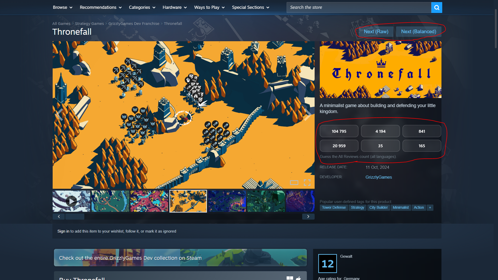

# Steam Review Guesser

## Overview

Steam Review Guesser (based on [Jonas Review Guesser](https://github.com/LooveToLoose/Jonas-Review-Guesser)) is a Firefox extension that turns Steam into a review guessing game. It hides the review count (and some other clues) on Steam store pages and asks you to guess the number of reviews instead. On top of that, it adds buttons at the top of the page that take you to completely random games on Steam, giving you a new way to browse the store, step outside your usual bubble, and gradually improve your intuition for how successful different games are.



### Random Game Navigation

- **Next (Raw)**
  - Sends you to a completely random Steam game.
  - Note: because this picks from *all* Steam games, you will often see:
    - Lower quality games
    - Shovelware / obscure titles
- **Next (Balanced)**
  - Sends you to a random Steam game with a bias toward “better” games.
  - This can still bring you to any game on Steam but the distribution is more biased towards better games:
    - Surfaces more recognizable / higher-quality titles more often.
    - Still maintains some variety so you don’t only see top hits.

## Limitations

It is a very simple application with many limitations:
- **Bug:** Current version only works when your Steam is set to English.
- Somewhat hinders your normal Steam browsing experience (you need to manually turn the Plugin off).
- The database of appIDs is not automatically updated so the newer titles might not be included.
- Sometimes the extension brings you to a Steam page that is not or no longer available in your region.
- Lacking a lot of features that might be cool e.g. filtering by tag, entering the guess into a text field, etc. etc.

It is not my plan to work on this too much more so if you'd like to see these limitations resolved, fork it and do it yourself! I only made it native firefox, and don't plan to update it much else. Feel free to contribute!

## Installation (Local Firefox Extension)

### Prerequisites

- **Firefox** or **Firefox-based browser** installed.
- The extension source code downloaded:
  - Either via `git clone`:
    ```bash
    git clone https://github.com/sabifiedsab/steam-review-guesser-firefox
    ```
  - Or by downloading a ZIP and extracting it.

### Step 1: Open the Add-ons Debugging Page

- In Firefox, go to:
  - `about:debugging#/runtime/this-firefox`

### Step 2: Load the Unpacked Extension

- Click **“Load Temporary Add-on”**.
- Select the folder containing the extension:
  - The folder that includes `manifest.json`.

### Step 3: Set Steam language to ENGLISH!
- **Set your language to "English"!** This is crucial for the current version to work.

### Step 4: Verify It Works

- Make sure the extension is **enabled** (toggle is on).
- Open any Steam store page:
  - Check if:
    - Review counts are replaced with guess buttons.
    - The **Next (Raw)** and **Next (Balanced)** buttons appear at the top of the page.

---

## Enabling / Disabling the Extension

### Enable

- Go to `about:addons`.
- Find **Steam Review Guesser**.
- Ensure the toggle is switched **on**.

### Disable

- Go to `about:addons`.
- Find **Steam Review Guesser**.
- Switch the toggle **off** to temporarily disable it.
- (Optional) Click the *three dots*, and **Remove** if you want to uninstall it completely.

---

## Updating the Extension

### When You Pull New Changes (Git) or Download a New Version

- If you updated the extension files by:
  - Running `git pull` in the project folder, or
  - Replacing the folder with a newer version,

do the following:

### Step 1: Open the Add-ons Debugging Page

- In Firefox, go to:
  - `about:debugging#/runtime/this-firefox`

### Step 2: Load the Unpacked Extension

- Click **“Load Temporary Add-on”**.
- Select the folder containing the extension:
  - The folder that includes `manifest.json`.

### Step 3: If Something Breaks

- Disable and re-enable the extension.
- If issues persist:
  - Click **Remove**.
  - Then click **Load Temporary Add-on...** again and select the updated folder.

---

## License

- Short summary:
  - Non-commercial use only.
  - Forking, modifying, and renaming allowed.
  - Giving credit is not required.
  - No warranty, no support, use at your own risk.

See the license file for more details.

## FAQ

> Can you add *(insert any feature)* to this extension?

Probably not. 

> I think it should be different. I think it should be...

Okay. Just make it.

